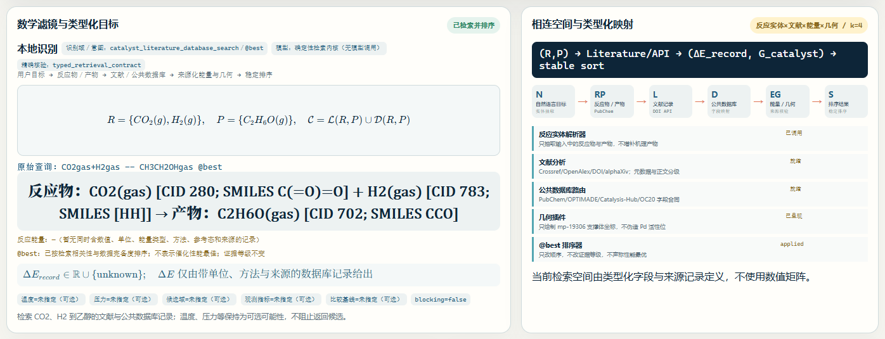
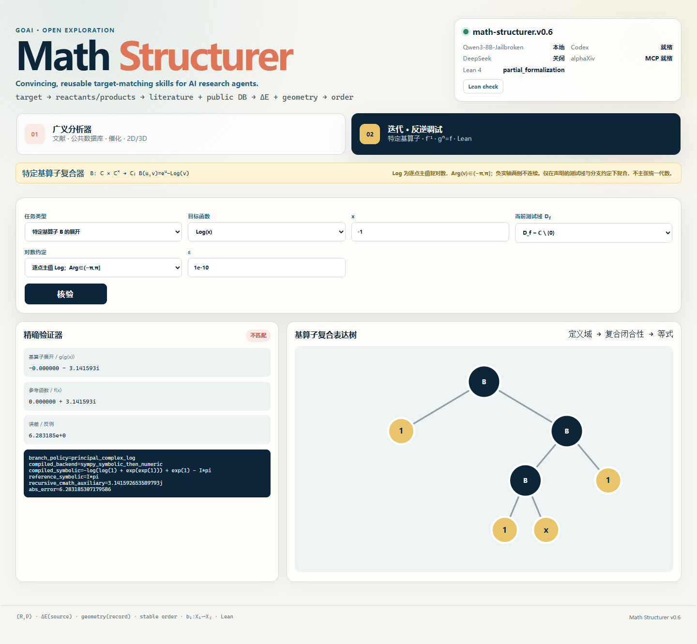

# 四页共用信息（不单独成页）

- **项目标题**：Math Structurer — Convincing, reusable target-matching skills for AI research agents.
- **一句话研究问题**：科研代理能否把自然语言反应目标转换为反应物、产物、带来源反应能量、催化剂空间几何和文献／公共数据库记录，并利用空值、来源冲突和几何缺口改变下一轮检索与排序，而不把候选记录冒充科学发现？
- **研究边界**：首版运行 **CO2gas+H2gas -- CH3CH2OHgas @best** 和独立的特定基算子调试；`@best` 只指定排序方式。温度、压力、候选范围、观测指标和基线均为可选 possibilities，缺失时不阻止文献或数据库查询。二维／三维图必须标注坐标来源状态；语言模型输出不充当证据。
- **当前成熟度**：交互原型 v0.6；Windows 的单行启动、本地识别、结构检查与浏览器试跑均有通过收据，Linux／macOS 仍为设计适配、未实测。当前没有统一口径的反应能量数值，没有催化性能结论，也没有催化剂发现。

---

# 四页正文

## Page 1

## 一、问题与证据

### 1.1 真实问题或需求

化学研究中的自然语言目标常把几个不同层次压缩在一句话里。以“二氧化碳与氢气生成乙醇，按 `@best` 返回催化剂”为例，科研工具至少需要区分反应物、产物、反应能量的物理定义与来源、催化剂记录、空间几何以及排序依据。若只返回一个材料名称，用户无法判断它来自论文正文、摘要、公共数据库元数据还是模型补写，也无法知道所显示几何是数据库坐标、计算结构还是示意投影。

真实文献说明这些字段具有研究意义。Wang 等研究 CO₂ 直接制乙醇时讨论 Na–Fe@C、K–CuZnAl、界面和组分邻近方式，并在补充材料中记录专业实验与计算设置；这支持按来源和结构信息组织候选，却不支持从题名或元数据直接推断跨论文性能次序（Wang et al., 2021，DOI：[10.1021/acscatal.1c01504](https://doi.org/10.1021/acscatal.1c01504)）。Pd₁/Fe₃O₄、Cu@Na-Beta 和有序 Pd–Cu 等公开记录可作为检索候选，但不同记录的能量定义、方法和几何来源并不天然可比，因此仍需逐项核对原始来源。

数学研究也具有“有限结构生成候选—验证器返回反例—下一轮改变表示”的共同工作流。半迭代的存在性依赖函数图或受限连续函数类的结构（Kozyra, 2021；Murugan & Palanivel, 2021），李对称可用于微分方程约化或表征学习（Güngör, 2025；Brandstetter et al., 2022；Mialon et al., 2024）。这些例子只用于说明类型化路由的必要性，不表示化学对象与数学对象已经属于同一个代数。

### 1.2 为什么尚未被结构化

困难首先来自语义不一致。“反应能量”可能指电子能差、焓变、自由能变、势垒或吸附能；如果缺少数值定义、单位、方法、参考态和来源，任何数字都不可复查。因此环境必须允许能量字段为空，并把 `null` 与数值零严格区分。其次，催化剂名称可能对应分子、团簇、表面、载体或界面，二维连线图、三维坐标和空间对称信息需要不同的数据来源与验证器。最后，论文、DOI 元数据、alphaXiv 记录和专业公共数据库提供的字段粒度不同；排序只能基于已经声明的证据字段，不能制造缺失的实验结论。

复杂推导同样提示“字段—来源—误差”必须一起保存。Deng、Hani 与 Ma 从硬球动力学长时导出 Boltzmann 方程时使用时间分层、累积量、部分展开、分子图和切割算法，并显式控制截断误差（Deng, Hani & Ma, 2025，[arXiv:2408.07818](https://arxiv.org/abs/2408.07818)，pp. 9–12）。该预印本不是催化证据，却说明专业对象不能被一次语言生成压缩为无来源的单一答案。

### 1.3 研究价值与合适切片

首版只要求科研代理建立一张可审计的“反应—证据—几何”记录：

| 字段 | 默认试跑内容 | 解释边界 |
|---|---|---|
| 反应物 | CO₂(g)、H₂(g) | 来自用户输入，不外推机理 |
| 产物 | C₂H₅OH(g) | 来自用户输入，不自动补写副产物 |
| 反应能量 | `—` | 未取得定义与来源一致的数值，空值不等于零 |
| 催化剂候选 | 带 DOI／公共记录链接的条目 | 候选不等于发现 |
| 空间几何 | Materials Project OPTIMADE 的 mp-19306 Fe₃O₄ 体相坐标 | 仅为 `support-only` 支撑体记录，不是 Pd 活性位 |
| `@best` | 按固定检索匹配分稳定排序 | 只改变次序，不表示催化性能最佳 |

排序使用固定、可复算的检索分，而不是可调科学权重：

\[
S(c)=50m_{RP}(c)+25m_{\mathrm{abs}}(c)+15m_{\mathrm{geom}}(c)+10m_{\mathrm{energy}}(c),
\]

四个指标依次表示反应物／产物匹配、摘要已核验、存在公共几何链接、存在可比能量记录，均取 0 或 1。温度、压力、候选范围、观测指标与基线可以进入后续筛选，但为空时系统仍继续检索。这个切片的研究价值不在于立即找出材料，而在于让科研代理根据能量空值、来源层级或几何缺口决定下一数据库、下一原文段落或下一专业插件。

- **页面专属字段**：反应物；产物；能量值／单位／定义／方法／来源／状态；候选记录；排序依据；几何来源状态。
- **文献依据**：Wang et al. (2021)；Kozyra (2021)；Murugan & Palanivel (2021)；Güngör (2025)；Brandstetter et al. (2022)；Mialon et al. (2024)；Deng, Hani & Ma (2025)。
- **建议视觉**：v0.6 演示截图，显示反应物—产物、能量空值、固定排序边界和相连空间；几何详情另显示 mp-19306 的来源与 `support-only` 范围。
- **人工确认项**：每个候选链接可追溯；能量未知保持空值；mp-19306 未写成 Pd 活性位；固定排序分未写成催化性能。
- **建议内容预算**：正文 850–950 字，一张字段表。

---

## Page 2

## 二、环境接口

### 2.1 固定规则

环境固定接收原始查询，并输出六类对象：反应物 (R)、产物 (P)、反应能量记录 (E)、催化剂候选 (C)、空间几何 (G) 和来源集合 (L)。接口是带类型的部分映射

\[
q\longmapsto(R,P,E,C,G,L),\qquad
E=(v,u,\rho,m,s,\sigma),
\]

其中 $v$ 为数值、$u$ 为单位、$\rho$ 为能量定义、$m$ 为实验或计算方法、$s$ 为来源、$\sigma$ 为核验状态。任一必要子字段缺失时 $v=\mathrm{null}$，界面显示 `—`，不得推断为零。候选记录至少保存名称、公共记录标识、URL、证据层级和检索时间；几何记录至少保存节点、边、坐标来源、对象范围及“体相／支撑体／表面／活性位”标签。

`@best` 的固定含义是调用公开的排序键；它不新增科学主张。温度、压力、候选范围、观测指标和基线作为 possibilities 进入可选字段，用户不填写时仍执行文献与公共数据库查询。只有元数据的记录不得被提升为能量、活性、选择性或机理证据；公共接口不可用时返回“接口不可用”，不得写成“相关研究不存在”。

各接口只承担其可核验职责。Catalysis-Hub 的 GraphQL 模式内省本轮返回 200，并显示反应物、产物、反应能量与原子系统字段；无密钥记录查询返回 401，因此当前没有取得记录级能量，且 `reaction_energy` 也可能是吸附能，跨论文不可直接排序（Winther et al., 2019）。OC20 提供初始／弛豫结构、能量、力、晶面和吸附位点，但不是完整反应网络（Chanussot et al., 2021）；Materials Project 的 `structure` 是最低能体相晶体，不是催化界面，其平衡反应能也不是任意用户反应。Crossref 与 OpenAlex 只负责书目信息和落地页。alphaXiv MCP 需要认证，默认读取结果是 AI 中间报告，只有 `fullText=true` 才请求原始抽取文本；失败时以 arXiv API 返回的规范元数据和版本链接回退。

### 2.2 观察／行动／反馈

| 接口 | 数据字段或工具操作 | 反馈如何改变下一步 |
|---|---|---|
| 观察 | 原始查询；(R,P)；能量六元组；候选 URL 与证据层级；几何来源；剩余预算 | 确定当前可核验字段和空值 |
| 行动 | 选择 DOI／alphaXiv／公共数据库适配器；改变检索式；打开摘要或正文；切换排序键；请求能量或几何插件 | 改变下一来源、下一字段或候选次序 |
| 反馈 | 已核验／仅元数据／缺失／冲突／接口不可用／超时；返回来源位置与原始字段 | 能量缺失→换能量来源；几何缺失→换结构接口；来源冲突→保留并列记录 |

对同一输入，科研代理下一轮可以改变数据库连接器、查询词、证据层级目标或几何对象范围；固定检索分本身不由 Agent 调权。它不能把模型推测写入已核验字段。反馈必须引起至少一次可见改变，例如从 DOI 元数据转向摘要、从空能量字段转向授权的记录级能量接口，或从 mp-19306 支撑体坐标转向带来源的活性位坐标检索。

### 2.3 记录与预算

每步日志保存查询版本、连接器名称、公共记录标识、URL、访问时间、字段原文、能量空值原因、几何来源状态、排序键、模型或插件版本、反馈和下一动作理由。本机 Qwen3-8B 检查点最多调用一次，只用于受限识别；Codex 或 DeepSeek 仅在用户显式选择时至多调用一个；文献和数据库接口合计最多八次；几何输出最多一幅二维和一幅三维视图；探索最多六轮。后端不可用必须写入日志，不得静默替换。

- **页面专属字段**：固定类型；观察字段；动作枚举；反馈状态；空值语义；来源日志；模型、接口、几何和轮数预算。
- **文献依据**：Wang et al. (2021)；Winther et al. (2019)；Chanussot et al. (2021)；Materials Project、Crossref、OpenAlex、alphaXiv 与 arXiv 官方接口文档；Deng, Hani & Ma (2025) 仅作复杂度参照。
- **建议视觉**：(q\to(R,P,E,C,G,L)) 的反馈闭环与能量字段结构。
- **人工确认项**：possibilities 为空不阻断；模型不是验证器；公共记录与科学结论分层；Linux／macOS 未宣称实测。
- **建议内容预算**：正文 650–750 字，一张接口表。

---

## Page 3

## 三、发现信号与参照

### 3.1 什么算发现

输出一个数据库材料名称或排序第一的记录不算发现。**正向发现**必须是可反驳的“几何—能量—反应”关系：在同一反应定义和可比能量口径下，至少两个独立来源或一个原始来源加专业数据库支持同一结构关系；能量的符号、单位、方法与参考态可追溯；几何具有来源坐标、对象范围和可复现构建规则；改变预注册检索词后该关系仍能复现。仅有 mp-19306 支撑体坐标不满足活性位几何条件。随后还须交给领域插件或专家核验。

三类非正向信号同样预先成立。**稳定负结果**是：在预注册的连接器集合和八次调用预算内，所有记录都缺少可比较的能量—几何联合字段；它只能说明当前数据覆盖不足，不能说明领域中没有该关系。**异常／反例**是：同一候选的能量符号、单位、能量定义或结构标识在来源间冲突。**问题定义修正**是：原先的“性能最佳”被改写为“按来源完整度排序”，或发现必须先区分自由能、电子能与势垒。当前演示环境最多取得接口、空值或问题修正信号，尚未构成催化剂发现。

### 3.2 平凡解／随机／无干预

候选出现的原因是公共记录与查询语义匹配，而不是系统已经证明其性能。令

\[
\mathcal D_q=\{d_i:\operatorname{match}(d_i,R,P)>0,\ \operatorname{source}(d_i)\neq\varnothing\},
\qquad c_i=\operatorname{record}(d_i).
\]

`@best` 只对 $\mathcal D_q$ 应用已声明的固定 $S(c)$。排序不会生成缺失能量，也不会改变证据层级。能量验证依次检查数值、单位、能量定义、方法、参考态和原文位置；几何验证检查记录标识、坐标来源、节点／边结构和对象范围。当前 mp-19306 只验证 Fe₃O₄ 体相支撑体坐标，不验证 Pd 活性位。文献验证分开记录 DOI 可解析、元数据已核验、摘要已读和正文已读。

| 参照 | 同预算操作 | 比较指标 |
|---|---|---|
| 平凡参照 | 直接让语言模型给材料名称 | 无来源候选数、虚构能量数、边界措辞 |
| 随机参照 | 随机排列同一批公共记录 | 排序稳定性、首位记录的证据完整度 |
| 无干预参照 | 单次关键词检索，不读来源层级 | 可点击来源数、空值是否被正确保留 |
| 非平凡基线 | 确定性合并 DOI／公共元数据并按证据完整度排序 | 重复记录率、来源覆盖、能量与几何可追溯率 |

### 3.3 最低成功与失败标准

**环境技术通过**必须同时满足三关。第一关是穿透式文献核验：DOI 由 Crossref／OpenAlex 核对身份与落地页；alphaXiv 只有在认证且 `fullText=true` 时才记为原文读取，否则明确标为 AI 中间报告或 401，并以 arXiv API 的版本化元数据回退。第二关是本地无数值验证器：反应物和产物字段可读，`@best` 严格按 50／25／15／10 固定分只改变排序，可选条件为空时仍返回结果，未知能量保持 `null`，至少三条候选带来源层级，mp-19306 明确标为 `support-only`，且零无来源催化数值。第三关是人工终审链接、字段、公式和结论边界。三关全过且至少一次反馈改变下一连接器、检索词或几何对象范围，才算环境技术通过。

**科学发现通过**还要求出现超过非平凡基线的可复现几何—能量关系，或出现跨预注册查询与连接器稳定复现的数据覆盖负结果，并由专业工具或领域专家核验。排序首位、论文标题或漂亮构型均不能单独通过这一闸门。当前项目明确保持“科学发现未通过”。

以下任一情形直接失败：把空能量写成零；把元数据写成实验或计算结论；把排序第一写成性能最佳；把数据库候选写成新发现；把示意图写成弛豫结构；可选 possibility 缺失便停止查询；接口不可用写成研究不存在；模型输出没有来源仍进入正式字段；反馈没有改变下一行动。

- **页面专属字段**：四类发现信号；能量与几何可比条件；四类参照；技术闸门；科学闸门；明确失败标准。
- **文献依据**：Wang et al. (2021)；alphaXiv／DOI 读取收据；公共记录与本地浏览器收据。
- **建议视觉**：左侧“环境技术通过”，右侧“科学发现通过”，中间列出空值、冲突和问题修正信号。
- **人工确认项**：ACS 主页面本轮未读；当前无统一能量数值、无性能结论、无催化发现。
- **建议内容预算**：正文 750–850 字，一张发现闸门表。

---

## Page 4

## 四、最小验证计划

### 4.1 一次试跑怎么做

解压后在项目根目录执行同一行命令：

~~~bash
python3 run.py
~~~

浏览器打开终端给出的本地地址，保留默认查询并点击一次“运行”。一次试跑只检查五项输出：反应物与产物是否正确分栏；反应能量未知时是否显示 `—`；五条候选是否带来源链接和证据层级；`@best` 是否严格按 50／25／15／10 固定分只改变次序；二维／三维是否显示 Materials Project OPTIMADE 的 mp-19306 Fe₃O₄ 坐标，并明确 `support-only`、不是 Pd 活性位。随后任选一条候选打开 DOI 或 alphaXiv 页面，并确认界面没有把标题扩写成能量或性能结论。离线结构检查为 **python3 run.py --check**。Windows 已实测；Linux 与 macOS 使用同一入口，但仍须在真实机器或持续集成中复跑后才能标为通过。

### 4.2 主要风险与失败路径

首要风险是“可信语气覆盖空值或对象范围”。系统必须保留以下失败：能量定义或来源缺失时只显示 `—`；只有元数据时不生成能量、活性或机理；重复公共记录不冒充独立证据；排序第一不改写成性能最佳；mp-19306 只显示为 Fe₃O₄ 体相支撑体，不补画 Pd 活性位；数据库超时保留接口状态；来源矛盾同时保存两侧原文。任何模型生成的 DOI、数值或结构标识都必须先解析原始页面，否则降为待核验。

数学调试面板还有独立风险：数值点上一致不等于函数恒等，含 **sorry** 或公理的 Lean 文件不等于完成证明。特定基算子

\[
B:\mathbb C\times\mathbb C^\times\to\mathbb C,\qquad B(u,v)=e^u-\operatorname{Log}v
\]

只在声明的测试域和主值复对数约定下复合；它不处理反应能量或催化剂坐标，也不代表统一代数。

### 4.3 复现与开源计划

开源包保存冻结查询、反应物／产物 JSON、能量六元组及空值原因、候选公共记录标识、固定排序特征、mp-19306 来源与 `support-only` 范围、逐步事件日志、来源链接、测试收据和源码哈希，不收录检索所得论文 PDF。复现者应能用同一命令得到相同字段结构，并分别复核“能量为空”“候选有来源”“几何对象范围明确”和“排序不改变证据等级”。发布前在 Ubuntu 与 macOS 各运行 **python3 run.py --check**，记录 Python 版本、提交哈希和终端输出；未通过的平台继续标为“未验证”，不得使用 Windows 收据替代。

- **页面专属字段**：单行命令；冻结输入；五项预期输出；空值规则；风险状态；平台状态；源码与日志哈希；开源边界。
- **文献依据**：Wang et al. (2021)；Kozyra (2021)；Crossref、OpenAlex、alphaXiv 与 arXiv 官方接口及本地浏览器收据。
- **建议视觉**：已生成的 v0.6 工作台截图，显示函数空间、特定基算子复合树、反例与 Lean 状态；化学截图另显示 mp-19306 的 `support-only` 边界。
- **人工确认项**：逐项打开来源；核对能量空值；检查排序边界与几何水印；不把设计适配写成跨平台实测。
- **建议内容预算**：正文 600–700 字，一行命令和一张复现表。

---

# 制作工作区（不进入四页文档）

## 页面—证据对应关系

| 页面 | 核心主张 | 直接依据 | 不可外推 |
|---|---|---|---|
| Page 1 | 催化剂候选的界面与邻近描述具有研究意义 | Wang et al. (2021) 官方摘要与补充材料 | 不证明跨论文性能次序或唯一机理 |
| Page 1 | 半迭代与微分方程方法依赖明确结构域 | Kozyra (2021)；Murugan & Palanivel (2021)；Güngör (2025) | 不证明跨领域统一代数 |
| Page 1–2 | 专业推导需保存结构、来源和误差口径 | Deng, Hani & Ma (2025) | 不证明本项目完成分子模拟 |
| Page 2 | 表面反应、吸附几何和体相结构需要分源读取 | Catalysis-Hub（Winther et al., 2019）；OC20（Chanussot et al., 2021）；Materials Project API | 三类能量和结构不能折叠为同一性能排名 |
| Page 2–3 | 书目身份、开放位置、AI 阅读和规范回退必须分层 | Crossref、OpenAlex、alphaXiv MCP、arXiv API 官方文档与实测收据 | 元数据或 AI 中间报告不等于原文结论 |
| Page 3 | 排序结果和公共记录不是科学发现 | 预注册发现标准与浏览器字段收据 | 不含催化性能实验或统一能量复算 |
| Page 4 | 复现必须保留空值、来源和几何标签 | 单行入口、JSON 与浏览器收据 | Linux／macOS 尚未实机验证 |

## 完整证据台账

### [Wang 2021] 已核验

- **主张**：CO₂ 直接制乙醇研究涉及多功能催化剂、界面与组分邻近方式，候选记录需要结构与来源上下文。
- **标题**：*Direct Conversion of CO₂ to Ethanol Boosted by Intimacy-Sensitive Multifunctional Catalysts*。
- **作者／机构**：Yang Wang et al.；ACS Catalysis。
- **日期**：2021-09-07。
- **URL**：https://doi.org/10.1021/acscatal.1c01504
- **访问日期**：2026-08-17。
- **原文支持点**：ACS Figshare 官方摘要讨论 Na–Fe@C、K–CuZnAl、界面与邻近方式；补充材料给出专业实验与计算设置。
- **局限**：ACS 主文章页面本轮返回 403；只核验 DOI、元数据、官方摘要和补充材料，不能声称主文全文已读，也不能跨论文推断性能次序。

### [Pd₁/Fe₃O₄ 2018] 已核验至摘要层

- **主张**：该公开记录可作为 CO₂ 加氢制乙醇的催化剂文献候选。
- **标题**：*Remarkable Carbon Dioxide Hydrogenation to Ethanol on a Palladium/Iron Oxide Single-Atom Catalyst*。
- **作者／机构**：公开记录所列作者；ChemCatChem。
- **日期**：2018。
- **URL**：https://doi.org/10.1002/cctc.201800362
- **访问日期**：2026-08-17。
- **原文支持点**：Handle／DOI 元数据与摘要层记录可追溯。
- **局限**：本项目没有复算统一反应能量，也不据此作性能排序。

### [Cu@Na-Beta 2020] 已核验至元数据层

- **主张**：该 DOI 是 CO₂ 加氢制乙醇检索中的公共候选记录。
- **标题**：*CO₂ Hydrogenation to Ethanol over Cu@Na-Beta*。
- **作者／机构**：公开元数据记录；Chem。
- **日期**：2020。
- **URL**：https://doi.org/10.1016/j.chempr.2020.07.001
- **访问日期**：2026-08-17。
- **原文支持点**：DOI 与题名元数据可解析。
- **局限**：正文和能量字段本轮未核验；只能标为元数据候选。

### [Kozyra 2021] 已核验

- **主张**：有限自映射的半迭代存在性可由函数图结构判定。
- **标题**：*The Structure of Functional Graphs for Functions From a Finite Domain to Itself for Which a Half Iterate Exists*。
- **作者／机构**：Paweł Marcin Kozyra；Theory and Applications of Graphs。
- **日期**：2021。
- **URL**：https://doi.org/10.20429/tag.2021.080108
- **访问日期**：2026-08-17。
- **原文支持点**：出版社页面给出有限函数图平方根存在性的结构判据。
- **局限**：只覆盖有限集合，不能外推到任意连续或光滑函数。

### [Murugan–Palanivel 2021] 已核验

- **主张**：一类受限连续函数存在迭代根与稳定性结果。
- **标题**：*Iterative Roots of Continuous Functions and Hyers–Ulam Stability*。
- **作者／机构**：V. Murugan；R. Palanivel；Aequationes Mathematicae。
- **日期**：2021。
- **URL**：https://doi.org/10.1007/s00010-020-00739-w
- **访问日期**：2026-08-17。
- **原文支持点**：出版社摘要明确限定函数类并讨论存在性与稳定性。
- **局限**：不是任意光滑函数的构造算法。

### [Deng–Hani–Ma 2025] 已核验

- **主张**：长时动力学推导需要结构化展开、图切割和误差控制。
- **标题**：*Long Time Derivation of the Boltzmann Equation from Hard Sphere Dynamics*。
- **作者／机构**：Yu Deng；Zaher Hani；Xiao Ma；arXiv。
- **日期**：arXiv:2408.07818v3，2025-07-18。
- **URL**：https://arxiv.org/abs/2408.07818
- **访问日期**：2026-08-17。
- **原文支持点**：本地 192 页文件 pp. 9–12 与 alphaXiv 读取收据。
- **局限**：仅作复杂度参照，不证明催化几何或本项目有效。

### [S1｜Catalysis-Hub] 已核验（待人工终审）

- **主张**：官方接口可按反应物／产物读取带类型的密度泛函能量，并把部分记录关联到原子结构。
- **标题**：*Catalysis-Hub.Org*；*CatHub Tutorial*；Catalysis-Hub GraphQL。
- **作者／机构**：Kirsten T. Winther 等；SUNCAT Center／Catalysis-Hub。
- **日期**：论文 2019-05-28；教程提交 2022-08-25；动态接口访问 2026-08-17。
- **URL**：https://doi.org/10.1038/s41597-019-0081-y；https://github.com/SUNCAT-Center/CatHub/blob/master/tutorial.md；https://api.catalysis-hub.org/graphql
- **原文支持点**：教程列出 `reactants`、`products`、`reaction_energy`、`facet`、`reaction_id` 与 `include_atoms=True`；本轮 GraphQL 模式内省返回 200 并确认 `reactants`、`products`、`reactionEnergy`、`surfaceComposition`、`systems`，无密钥记录查询返回 401 `Missing API key`。
- **局限**：能量可能是吸附能；不同论文的泛函、参考态与设置不可直接合并排序；本轮未核验覆盖全部数据记录的统一许可。

### [S2｜OC20] 已核验（待人工终审）

- **主张**：OC20 提供吸附体—催化剂初始／弛豫结构、能量、力以及晶面和吸附位点字段。
- **标题**：*The Open Catalyst 2020 (OC20) Dataset and Community Challenges*；OC20 官方数据文档。
- **作者／机构**：Lowik Chanussot 等；FAIR Chemistry／Open Catalyst Project。
- **日期**：论文 2021；官方文档访问 2026-08-17。
- **URL**：https://doi.org/10.1021/acscatal.0c04525；https://github.com/facebookresearch/fairchem/blob/main/docs/catalysts/datasets/oc20.md
- **原文支持点**：S2EF 记录结构、能量和力；IS2RS／IS2RE 记录初始结构、弛豫结构与弛豫能；映射含 `bulk_mpid`、Miller 指数和 `adsorption_site`；数据许可为 CC-BY-4.0。
- **局限**：它不是 `CO₂+H₂→乙醇` 的完整反应网络；吸附能或弛豫能不能改写成实验反应性能；演示应使用预索引小样本而非大型数据包。

### [S3｜Materials Project] 已核验（待人工终审）

- **主张**：官方 API 可提供体相组成、最低能晶体结构与若干热力学字段，适合作为体相补充。
- **标题**：*Materials Project API*，OpenAPI v0.87.2.dev19。
- **作者／机构**：Materials Project。
- **日期**：动态规范访问 2026-08-17。
- **URL**：https://api.materialsproject.org/openapi.json；https://docs.materialsproject.org/downloading-data/using-the-api/getting-started
- **原文支持点**：`SummaryDoc` 含 `material_id`、`structure`、形成能、凸包能和平衡反应能；结构模式含晶格及分数／笛卡尔坐标；OpenAPI 无密钥查询返回 401。
- **局限**：`structure` 是最低能体相晶体，不是吸附界面；平衡反应能不是任意用户反应能；`decomposes_to` 不是用户查询中的产物。

### [S4｜Crossref] 已核验（待人工终审）

- **主张**：Crossref 可核对 DOI、题名、作者、日期、出版者和落地页。
- **标题**：*Crossref REST API*。
- **作者／机构**：Crossref。
- **日期**：文档更新 2020-04-08；接口访问 2026-08-17。
- **URL**：https://www.crossref.org/documentation/retrieve-metadata/rest-api/；https://api.crossref.org/works/10.1021/acscatal.1c01504
- **原文支持点**：目标 ACS DOI 返回 200 及书目信息；该记录无摘要；出版者自动访问本轮返回 403。
- **局限**：Crossref 不提供反应能或几何；PDF 链接存在不代表拥有下载、读取或再分发权；引用计数不是性能证据。

### [S5｜OpenAlex] 已核验（待人工终审）

- **主张**：OpenAlex 可用于文献发现、开放状态和可访问位置核对。
- **标题**：*OpenAlex Works API*；*Work Attributes*；*Authentication*。
- **作者／机构**：OpenAlex。
- **日期**：动态文档访问 2026-08-17。
- **URL**：https://api.openalex.org/works/https://doi.org/10.1021/acscatal.1c01504；https://help.openalex.org/data/works/attributes.md
- **原文支持点**：目标 DOI 无密钥返回 200，含落地页与开放状态；本轮 `pdf_url=null`、`has_fulltext=false`、`best_oa_location=null`。
- **局限**：摘要倒排索引不等于全文，算法主题不是作者结论；OpenAlex 不提供反应能或催化几何。

### [S6｜alphaXiv MCP] 已核验（待人工终审）

- **主张**：alphaXiv MCP 可搜索论文、生成中间报告、请求原文抽取并做带页码查询。
- **标题**：*MCP Server Documentation*。
- **作者／机构**：alphaXiv。
- **日期**：页面未标注；访问 2026-08-17。
- **URL**：https://alphaxiv.org/docs/mcp；https://api.alphaxiv.org/mcp/v1
- **原文支持点**：官方端点采用 OAuth 2.1／Bearer token；`get_paper_content` 默认返回 AI 中间报告，只有 `fullText=true` 才请求原始抽取文本；无认证请求本轮返回 401。
- **局限**：AI 中间报告不是原文证据；页级过滤可能丢失上下文；浏览器直接集成受 CORS 限制，需要本地桥接。

### [S7｜arXiv API] 已核验（待人工终审）

- **主张**：arXiv API 可作为 alphaXiv 不可用时的规范元数据与版本链接回退。
- **标题**：*arXiv API Access*；*Terms of Use for arXiv APIs*。
- **作者／机构**：arXiv。
- **日期**：Terms 更新 2026-08-13；访问 2026-08-17。
- **URL**：https://export.arxiv.org/api/query?id_list=2408.07818；https://info.arxiv.org/help/api/index.html
- **原文支持点**：Atom 响应返回版本化编号、题名、作者、摘要、发布日期、更新时间、分类和规范链接；本轮 `2408.07818` 返回 v3 与三位作者。
- **局限**：描述性元数据为 CC0 不代表论文 PDF 可任意再分发；预印本版本必须固定，且不能写成同行评审结论。

### [本地语义试跑] 已核验

- **主张**：v0.6 试跑显示反应物、产物、能量空值、五条来源候选、固定排序边界和 mp-19306 支撑体几何范围；一次反馈给出下一连接器与活性位坐标检索动作。
- **标题**：Math Structurer v0.6 本地浏览器、Qwen 识别与结构检查收据。
- **作者／机构**：本项目。
- **日期**：2026-08-17。
- **URL**：`artifacts/qwen_recognition_acceptance.json`；`artifacts/panel/browser_acceptance.json`；`artifacts/visuals/`。
- **原文支持点**：Windows 收据记录本地模型一次受限识别、能量 `null`、固定 50／25／15／10 排序式、mp-19306／`support_only`、五条候选、零外网浏览器请求及通过状态。
- **局限**：这是接口与过程信号，不是催化发现；mp-19306 是 Fe₃O₄ 体相支撑体坐标，不是 Pd 活性位；Linux／macOS 尚未实机运行。

## 术语表

| 术语 | 本文含义 |
|---|---|
| `@best` | 固定使用 `50×反应匹配+25×摘要已核验+15×公共几何链接+10×可比能量记录`；只改变次序，不表示性能最佳。 |
| reaction energy | 必须同时携带数值、单位、能量定义、方法、来源和状态；缺项时数值为 `null`。 |
| energy kind | 至少区分表面反应密度泛函能、吸附能、弛豫结构能、每原子形成能、凸包能和平衡分解能；不同类型不得直接同轴排名。 |
| possibility | 可选筛选维度；温度、压力、候选范围、观测指标和基线为空时仍继续查询。 |
| 公共数据库候选 | 有可追溯记录标识与 URL 的条目；不是科学发现。 |
| 几何来源状态 | 当前为 Materials Project OPTIMADE `mp-19306` 的 Fe₃O₄ 体相坐标，范围 `support-only`；不是 Pd 活性位。 |
| 发现信号 | 预先声明的可复现关系、稳定数据覆盖负结果、来源异常或问题定义修正。 |

## 未决问题

1. 首个专业反应能量接口选择哪一类公开数据库，如何统一能量定义、单位、方法和参考态？
2. 催化表面、载体和界面应采用何种结构标识，才能避免把材料名称误当成唯一几何？
3. 固定 50／25／15／10 排序式的特征取值和并列规则，能否在封存查询上稳定复算并优于随机次序？
4. 半迭代切片应先限定有限函数图、分段仿射连续映射，还是其他可穷举空间？
5. Linux 与 macOS 的持续集成矩阵、Python 版本和可选 SymPy 安装方式仍待实测。

## AI 不确定性声明

- “多个领域需要共享类型化接口”是待检验研究假设，不是文献共识。
- 当前催化剂条目来自可追溯记录，但没有按统一能量定义复算，不能产生性能结论。
- Catalysis-Hub 模式内省本轮返回 200，但无密钥记录查询返回 401；Materials Project 常规无密钥数据查询也返回 401。OC20 不是实时轻量接口，也不是完整反应网络。当前演示不得把模式字段写成已取得记录级能量。
- alphaXiv 默认结果是 AI 中间报告；只有认证且 `fullText=true` 的原始抽取，或人工打开的规范原文，才能升级正文层级。
- ACS 主文章页面本轮未打开；只核验 DOI、元数据、官方摘要和补充材料。
- 当前二维／三维来自 mp-19306 的公共笛卡尔坐标，但仅代表 Fe₃O₄ 体相支撑体；显示边由非周期距离阈值生成，不能支持 Pd 活性位、界面机理或空间群结论。
- Qwen3-8B-Jailbroken、Codex 与 DeepSeek 只能帮助识别、检索或反方检查；模型输出必须经过原始来源或专业工具核验。
- Windows 本地结果不等于 Linux／macOS 已通过；真实平台复跑前保持“设计适配、未实测”。
